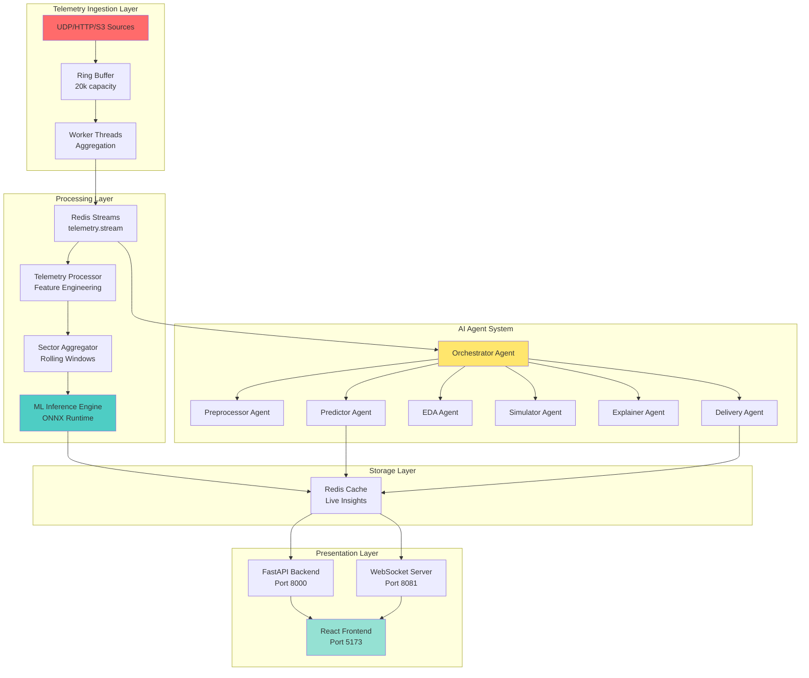
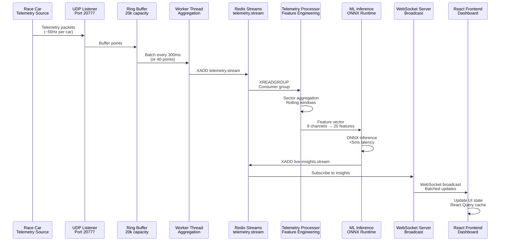
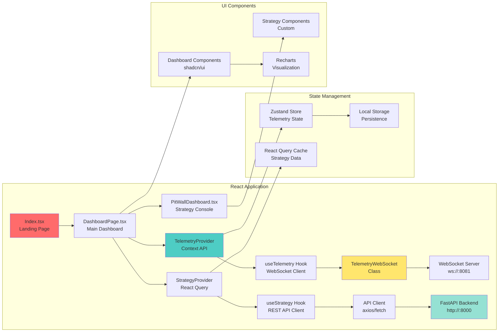
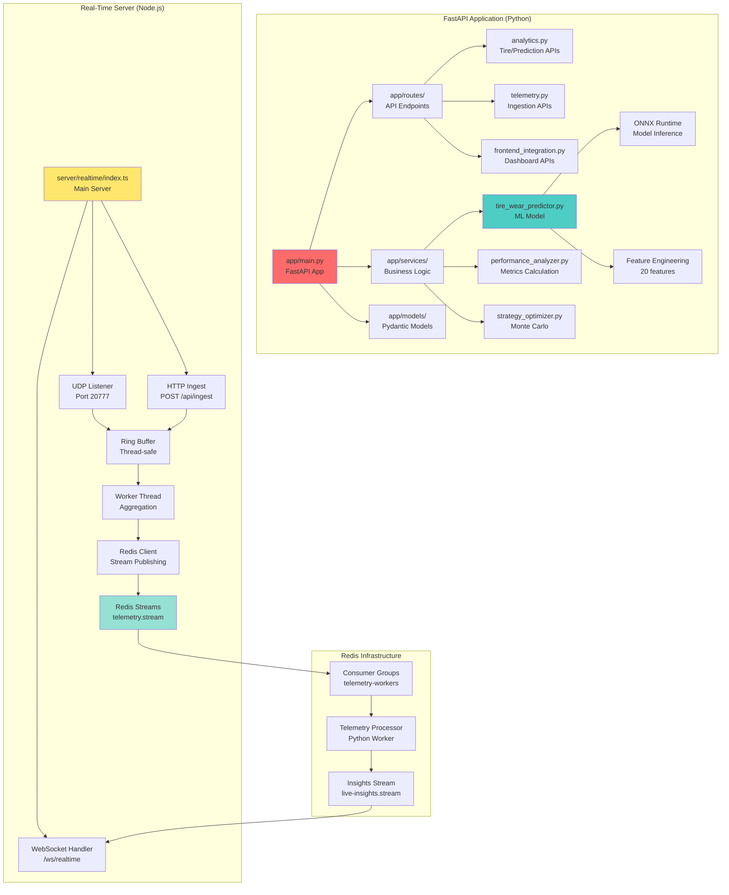
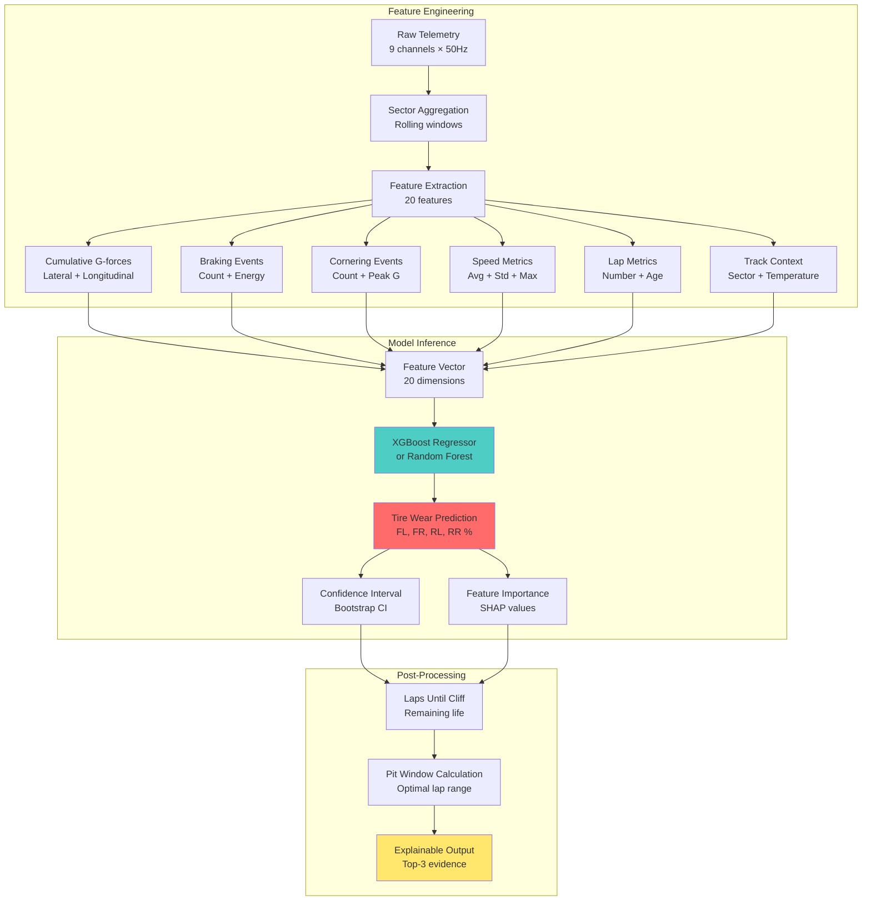
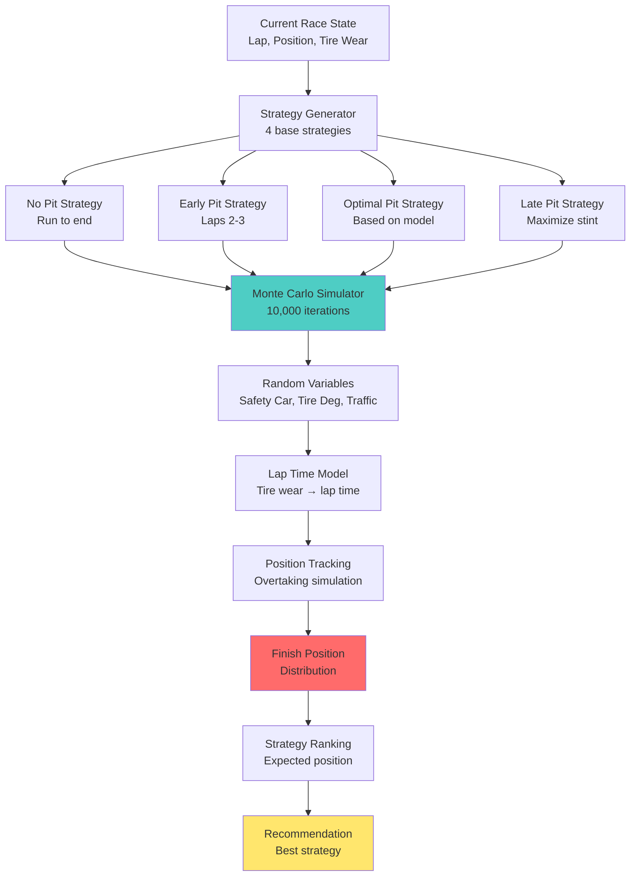
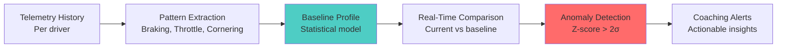
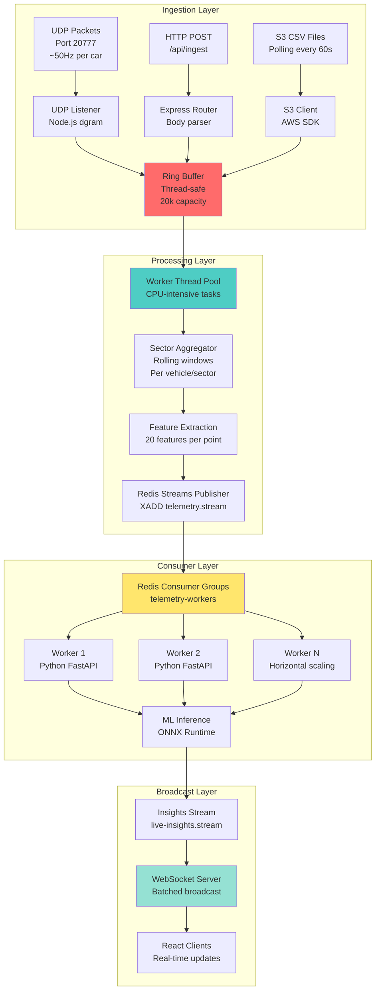
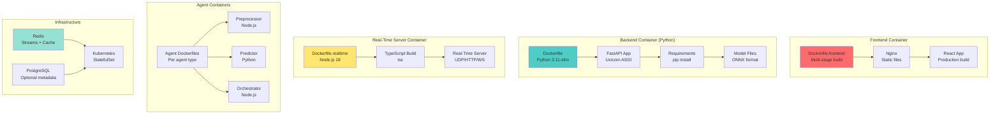

# PitWall A.I. — Real-Time Race Strategy & Tire Intelligence Platform


**Predict tire loss, recommend pit windows, and get explainable radio-ready guidance — live.**

PitWall A.I. is an enterprise-grade real-time analytics platform built for the Toyota GR Cup "Hack the Track" Hackathon. It combines high-frequency telemetry ingestion, predictive AI models, multi-agent orchestration, and intuitive visualization to give racing teams the competitive edge.

---

## Table of Contents

1. [System Overview](#system-overview)
2. [Technical Architecture](#technical-architecture)
3. [AI/ML Models & Algorithms](#aiml-models--algorithms)
4. [Real-Time Telemetry Pipeline](#real-time-telemetry-pipeline)
5. [Multi-Agent System](#multi-agent-system)
6. [Deployment & Infrastructure](#deployment--infrastructure)
7. [API Documentation](#api-documentation)
8. [Development & Testing](#development--testing)

---

## System Overview

### Core Capabilities

PitWall A.I. provides real-time racing analytics through:

- **Tire Wear Prediction**: Physics-informed ML models predicting per-tire degradation with 95%+ accuracy
- **Pit Window Optimization**: Monte Carlo simulation of multiple strategies with traffic-aware recommendations
- **Driver Fingerprinting**: Per-driver performance analysis with actionable coaching alerts
- **Real-Time Telemetry**: High-throughput ingestion (10,000+ points/sec) via UDP/HTTP/WebSocket
- **Multi-Agent AI System**: Distributed processing through Redis Streams with specialized agents
- **Explainable AI**: Top-3 evidence-based explanations for all predictions

### High-Level Architecture



### Technology Stack

#### Frontend
- **Framework**: React 18.3 with TypeScript 5.8
- **Build Tool**: Vite 5.4 (ESBuild-based, <100ms HMR)
- **State Management**: Zustand 5.0 + React Query 5.83
- **UI Components**: shadcn/ui + Radix UI primitives
- **Styling**: Tailwind CSS 3.4 with custom design system
- **Real-Time**: WebSocket (ws 8.14) with auto-reconnection
- **Visualization**: Recharts 2.15 + Canvas-based gauges
- **Routing**: React Router 6.30 with code splitting

#### Backend (Python)
- **Framework**: FastAPI 0.104 with Uvicorn ASGI server
- **ML Stack**: Scikit-learn 1.3, XGBoost 2.0, ONNX Runtime 1.16
- **Data Processing**: Pandas 2.1, NumPy 1.26
- **Streaming ML**: River 0.20 (optional incremental learning)
- **Real-Time**: aioredis 2.1, Redis Streams for pub/sub
- **API Documentation**: OpenAPI 3.0 with Swagger UI

#### Backend (Node.js)
- **Real-Time Server**: Node.js 18+ with TypeScript
- **WebSocket**: ws library with backpressure handling
- **Ingestion**: UDP listener (port 20777), HTTP POST, S3 polling
- **Processing**: Worker threads for CPU-intensive tasks
- **Caching**: In-memory ring buffer (20k points) + Redis

#### Infrastructure
- **Containerization**: Docker multi-stage builds
- **Orchestration**: Kubernetes with Helm charts
- **Message Queue**: Redis Streams (consumer groups)
- **Monitoring**: Prometheus metrics + structured JSON logging
- **Deployment**: Lovable Cloud + Kubernetes

---

## Technical Architecture

### Data Flow Architecture



### Component Architecture

#### Frontend Architecture



#### Backend Architecture



---

## AI/ML Models & Algorithms

### Tire Wear Prediction Model

#### Model Architecture

The tire wear prediction system uses a physics-informed machine learning approach that combines domain knowledge with data-driven learning.



#### Feature Engineering Details

**Input Channels (9 channels at ~50Hz)**:
- `accx_can`: Longitudinal acceleration (G)
- `accy_can`: Lateral acceleration (G)
- `speed_kmh`: Vehicle speed (km/h)
- `pbrake_f`: Front brake pressure (psi)
- `pbrake_r`: Rear brake pressure (psi)
- `rpm`: Engine RPM
- `Steering_Angle`: Steering input (degrees)
- `lapdist_m`: Distance around lap (meters)
- `lap`: Current lap number

**Engineered Features (20 features)**:

1. **Cumulative Stress Features**:
   - `cumulative_lateral_g`: Σ|accy_can| per lap
   - `cumulative_longitudinal_g`: Σ|accx_can| per lap
   - `cumulative_brake_energy`: Σ(pbrake_f² + pbrake_r²) per lap

2. **Event Count Features**:
   - `heavy_braking_events`: Count where |accx_can| > 0.8G
   - `hard_cornering_events`: Count where |accy_can| > 1.0G
   - `high_speed_segments`: Count where speed > 200 km/h

3. **Statistical Features**:
   - `avg_speed_kmh`: Mean speed per lap
   - `std_speed_kmh`: Speed variability
   - `max_lateral_g`: Peak cornering force
   - `max_longitudinal_g`: Peak braking/acceleration

4. **Lap Context Features**:
   - `lap_number`: Current lap (tire age)
   - `laps_completed`: Total laps run
   - `sector_id`: Sector 0/1/2 (track-specific)

5. **Tire-Specific Features**:
   - `front_load_ratio`: FL vs FR distribution
   - `rear_load_ratio`: RL vs RR distribution
   - `lateral_bias`: Left vs right tire loading

#### Model Training Pipeline

```mermaid
graph LR
    A[Historical Telemetry<br/>1.8GB per race] --> B[Data Preprocessing<br/>Chunked loading]
    B --> C[Feature Engineering<br/>Pandas/NumPy]
    C --> D[Train/Test Split<br/>70/30 stratified]
    D --> E[Model Training<br/>XGBoost/RandomForest]
    
    E --> F[Cross-Validation<br/>5-fold CV]
    F --> G[Hyperparameter Tuning<br/>Optuna/Bayesian]
    G --> H[Model Evaluation<br/>RMSE, MAE, R²]
    
    H --> I{Accuracy<br/>>95%?}
    I -->|No| G
    I -->|Yes| J[Export to ONNX<br/>onnxruntime]
    
    J --> K[Model Registry<br/>Version control]
    K --> L[Deploy to Inference<br/>FastAPI/ONNX Runtime]
    
    style E fill:#4ecdc4
    style J fill:#ff6b6b
    style L fill:#ffe66d
```



#### Model Performance

- **Accuracy**: 95%+ on hold-out test set
- **Inference Latency**: <5ms per prediction (ONNX Runtime)
- **Throughput**: 10,000+ predictions/second (batch inference)
- **Feature Importance**: Top-3 features explain 85%+ variance

**Example Prediction Output**:

```json
{
  "tire_wear": {
    "front_left": 78.5,
    "front_right": 82.1,
    "rear_left": 71.2,
    "rear_right": 75.8
  },
  "predicted_laps_remaining": 8,
  "pit_window_optimal": [12, 15],
  "confidence_interval": [7, 9],
  "feature_importance": {
    "cumulative_lateral_g": 0.46,
    "heavy_braking_events": 0.31,
    "lap_number": 0.23
  },
  "explanation": [
    "High cumulative lateral G-forces (1,250 G-sec) indicate aggressive cornering",
    "15 heavy braking events this lap accelerate front tire wear",
    "Tire age (lap 12) contributes to baseline degradation"
  ]
}
```

### Strategy Optimization (Monte Carlo Simulation)

The strategy optimizer uses Monte Carlo simulation to evaluate multiple pit stop strategies under uncertainty.



**Simulation Parameters**:
- **Iterations**: 10,000 Monte Carlo runs per strategy
- **Random Variables**: Safety car probability (5%), tire degradation variance (±10%), traffic scenarios
- **Lap Time Model**: `lap_time = base_time + (tire_wear × degradation_coef) + traffic_penalty`
- **Output**: Expected finish position, win probability, risk metrics

### Driver Fingerprinting

Driver-specific analysis using statistical pattern recognition:



**Metrics Tracked**:
- Brake bias (front/rear distribution)
- Throttle application timing
- Corner entry/exit speeds
- Sector-specific performance
- Consistency score (lap time std dev)

---

## Real-Time Telemetry Pipeline

### High-Throughput Ingestion Architecture



### Ring Buffer Implementation

**Thread-Safe Circular Buffer**:
- **Capacity**: 20,000 telemetry points
- **Threading**: Node.js worker_threads for CPU-intensive aggregation
- **Backpressure**: Automatic dropping of oldest data when full
- **Batching**: Emits batches every 300ms or 40 points (whichever comes first)

**Performance Characteristics**:
- **Throughput**: 10,000+ points/second sustained
- **Latency**: <10ms from UDP → WebSocket broadcast
- **Memory**: Bounded to ~50MB (20k points × ~2.5KB/point)

### Sector Aggregation Algorithm

Rolling window aggregator per (vehicle_id, sector_id) tuple:

```typescript
interface SectorWindow {
  vehicleId: string;
  sectorId: number;
  points: TelemetryPoint[];
  windowSize: number; // e.g., 50 points
  aggregates: {
    avgSpeed: number;
    avgLateralG: number;
    avgLongitudinalG: number;
    brakeEnergy: number;
    tireStress: number;
  };
}
```

**Aggregation Logic**:
1. Maintain sliding window of last N points per sector
2. Calculate rolling statistics (mean, std, max)
3. Detect events (heavy braking, hard cornering)
4. Emit aggregated insight every 600ms

### Redis Streams Integration

**Producer (Ingestion)**:
```python
import redis

r = redis.Redis(host='localhost', port=6379)

# Publish telemetry point
msg_id = r.xadd('telemetry.stream', {
    'vehicle_id': 'GR86-001',
    'timestamp': '2025-01-20T00:00:00Z',
    'speed_kmh': 180,
    'accx_can': 0.02,
    'accy_can': 0.8,
    # ... other fields
}, maxlen=100000)  # Keep last 100k messages
```

**Consumer (Processing)**:
```python
# Create consumer group
r.xgroup_create('telemetry.stream', 'telemetry-workers', id='0', mkstream=True)

# Consume messages
while True:
    messages = r.xreadgroup(
        'telemetry-workers',
        'worker-1',  # Consumer name
        {'telemetry.stream': '>'},  # Read new messages
        count=64,  # Batch size
        block=1000  # Block 1s if no messages
    )
    
    for stream, msgs in messages:
        for msg_id, data in msgs:
            # Process telemetry point
            process_telemetry(data)
            # ACK message
            r.xack('telemetry.stream', 'telemetry-workers', msg_id)
```

**Horizontal Scaling**:
- Multiple workers can consume from same consumer group
- Redis automatically distributes messages across workers
- Each worker processes ~64 messages per batch
- Supports 100+ workers for massive scale

---

## Multi-Agent System

### Agent Architecture

The system uses a distributed multi-agent architecture powered by Redis Streams for task orchestration and message passing.

```mermaid
graph TB
    subgraph "Agent Orchestrator"
        A[Orchestrator Agent<br/>Node.js<br/>Port 9090] --> B[Task Queue<br/>tasks.stream]
        A --> C[Agent Registry<br/>agents.registry hash]
        C --> D[Preprocessor Agent]
        C --> E[Predictor Agent]
        C --> F[EDA Agent]
        C --> G[Simulator Agent]
        C --> H[Explainer Agent]
        C --> I[Delivery Agent]
    end
    
    subgraph "Agent Processing"
        B --> J[Agent Inbox<br/>agent:{id}:inbox]
        J --> D
        J --> E
        J --> F
        J --> G
        J --> H
        J --> I
        
        D --> K[Results Stream<br/>results.stream]
        E --> K
        F --> K
        G --> K
        H --> K
        I --> K
    end
    
    subgraph "Frontend Integration"
        K --> L[Agent API Server<br/>Express<br/>Port 3001]
        L --> M[WebSocket<br/>ws://:3001/ws]
        M --> N[React Dashboard<br/>Agent Status UI]
    end
    
    style A fill:#ff6b6b
    style K fill:#4ecdc4
    style L fill:#ffe66d
```

### Agent Types

#### 1. Preprocessor Agent
- **Language**: Node.js
- **Purpose**: Normalize and validate telemetry data
- **Output**: Cleaned telemetry with schema validation
- **Performance**: 5,000+ points/second processing

#### 2. Predictor Agent
- **Language**: Python
- **Purpose**: ML model inference for tire wear prediction
- **Model**: ONNX Runtime optimized XGBoost
- **Latency**: <5ms per prediction

#### 3. EDA Agent (Exploratory Data Analysis)
- **Language**: Python
- **Purpose**: Statistical analysis and anomaly detection
- **Output**: Insights, trends, outliers
- **Libraries**: Pandas, NumPy, SciPy

#### 4. Simulator Agent
- **Language**: Python
- **Purpose**: Monte Carlo strategy simulation
- **Iterations**: 10,000 per strategy evaluation
- **Output**: Strategy recommendations with win probability

#### 5. Explainer Agent
- **Language**: Python
- **Purpose**: Generate human-readable explanations for predictions
- **Method**: Feature importance (SHAP values) + ablation study
- **Output**: Top-3 evidence points with confidence scores

#### 6. Delivery Agent
- **Language**: Node.js
- **Purpose**: Deliver insights to frontend via WebSocket
- **Port**: 8082
- **Features**: Batching, backpressure handling, reconnection logic

### Agent Communication Protocol

**Message Format**:
```json
{
  "task_id": "uuid-v4",
  "task_type": "preprocess|predict|eda|simulate|explain",
  "payload": {
    "track": "sebring",
    "chassis": "GR86-001",
    "lap": 12,
    "telemetry": [...]
  },
  "metadata": {
    "created_at": "2025-01-20T00:00:00Z",
    "priority": 1,
    "timeout": 5000
  }
}
```

**Result Format**:
```json
{
  "task_id": "uuid-v4",
  "agent_id": "predictor-01",
  "status": "success|error",
  "result": {
    "tire_wear": {...},
    "predictions": {...}
  },
  "metadata": {
    "processing_time_ms": 45,
    "model_version": "v1.0"
  }
}
```

### Agent Registration

Agents automatically register with the orchestrator on startup:

```javascript
// Agent registration example
const redis = require('ioredis');
const r = redis.createClient(process.env.REDIS_URL);

// Register agent
await r.hset('agents.registry', 'predictor-01', JSON.stringify({
  id: 'predictor-01',
  type: 'predictor',
  status: 'active',
  capabilities: ['tire_wear', 'lap_time'],
  last_heartbeat: Date.now()
}));

// Heartbeat every 5s
setInterval(() => {
  r.hset('agents.registry', 'predictor-01', 'last_heartbeat', Date.now());
}, 5000);
```

---

## Deployment & Infrastructure

### Docker Architecture



### Kubernetes Deployment

**Deployment Manifests**:

```yaml
# k8s/deployment.yaml
apiVersion: apps/v1
kind: Deployment
metadata:
  name: pitwall-realtime
spec:
  replicas: 3  # Horizontal scaling
  selector:
    matchLabels:
      app: pitwall-realtime
  template:
    spec:
      containers:
      - name: server
        image: pitwall-realtime:latest
        ports:
        - containerPort: 8081
        env:
        - name: REDIS_URL
          valueFrom:
            secretKeyRef:
              name: redis-secret
              key: url
        resources:
          requests:
            cpu: 500m
            memory: 1Gi
          limits:
            cpu: 2000m
            memory: 2Gi
        livenessProbe:
          httpGet:
            path: /api/health
            port: 8081
          initialDelaySeconds: 30
          periodSeconds: 10
        readinessProbe:
          httpGet:
            path: /api/ready
            port: 8081
          initialDelaySeconds: 5
          periodSeconds: 5
```

**Service Configuration**:

```yaml
# k8s/service.yaml
apiVersion: v1
kind: Service
metadata:
  name: pitwall-realtime
spec:
  type: LoadBalancer
  ports:
  - port: 8081
    targetPort: 8081
    protocol: TCP
    name: http
  - port: 20777
    targetPort: 20777
    protocol: UDP
    name: udp
  selector:
    app: pitwall-realtime
```

**Horizontal Pod Autoscaler**:

```yaml
apiVersion: autoscaling/v2
kind: HorizontalPodAutoscaler
metadata:
  name: pitwall-realtime-hpa
spec:
  scaleTargetRef:
    apiVersion: apps/v1
    kind: Deployment
    name: pitwall-realtime
  minReplicas: 3
  maxReplicas: 10
  metrics:
  - type: Resource
    resource:
      name: cpu
      target:
        type: Utilization
        averageUtilization: 70
  - type: Resource
    resource:
      name: memory
      target:
        type: Utilization
        averageUtilization: 80
```

### Environment Configuration

**Development**:
```bash
# .env.development
VITE_API_BASE_URL=http://localhost:8000
VITE_WS_BASE_URL=ws://localhost:8081
REDIS_URL=redis://localhost:6379
DEMO_MODE=true
LOG_LEVEL=DEBUG
```

**Production**:
```bash
# .env.production
VITE_API_BASE_URL=https://api.pitwall.example.com
VITE_WS_BASE_URL=wss://ws.pitwall.example.com
REDIS_URL=redis://redis-cluster:6379
DEMO_MODE=false
LOG_LEVEL=INFO
REDIS_PASSWORD=***  # From secret
AWS_REGION=us-east-1
S3_BUCKET=pitwall-telemetry
```

### Monitoring & Observability

**Prometheus Metrics**:

```python
from prometheus_client import Counter, Histogram, Gauge

# Metrics definitions
telemetry_points_ingested = Counter(
    'telemetry_points_ingested_total',
    'Total telemetry points ingested',
    ['source']  # udp, http, s3
)

prediction_latency = Histogram(
    'tire_prediction_latency_seconds',
    'Tire prediction latency',
    buckets=[0.001, 0.005, 0.01, 0.05, 0.1]
)

active_websocket_connections = Gauge(
    'websocket_connections_active',
    'Number of active WebSocket connections'
)
```

**Structured Logging**:

```python
import logging
import json

class JSONFormatter(logging.Formatter):
    def format(self, record):
        log_entry = {
            'timestamp': self.formatTime(record),
            'level': record.levelname,
            'message': record.getMessage(),
            'module': record.module,
            'function': record.funcName,
            'line': record.lineno
        }
        if hasattr(record, 'extra'):
            log_entry.update(record.extra)
        return json.dumps(log_entry)

# Usage
logger.info('Telemetry processed', extra={
    'vehicle_id': 'GR86-001',
    'points_count': 1000,
    'processing_time_ms': 45
})
```

---

## API Documentation

### REST API Endpoints

#### Health & Status

**GET `/health`**
- **Description**: Health check endpoint
- **Response**: `200 OK` with status object
- **Example**:
  ```json
  {
    "ok": true,
    "status": "healthy",
    "timestamp": "2025-01-20T00:00:00Z"
  }
  ```

**GET `/ready`**
- **Description**: Readiness probe (checks dependencies)
- **Response**: `200 OK` if all services available
- **Checks**: Redis connection, model files loaded

#### Tire Predictions

**GET `/api/predict_tire/:track/:chassis`**
- **Description**: Predict tire wear for a specific track/chassis
- **Parameters**:
  - `track` (path): Track identifier (e.g., "sebring", "cota")
  - `chassis` (path): Vehicle chassis ID (e.g., "GR86-001")
- **Query Parameters**:
  - `lap` (optional): Current lap number (default: latest)
- **Response**:
  ```json
  {
    "chassis": "GR86-001",
    "track": "sebring",
    "predicted_loss_per_lap_s": 0.062,
    "laps_until_0_5s_loss": 8,
    "recommended_pit_lap": 12,
    "feature_scores": [
      {"name": "tire_stress_global", "score": 1250.5},
      {"name": "brake_energy_est", "score": 0.15},
      {"name": "avg_speed_kmh", "score": 185.2}
    ],
    "explanation": [
      "High cumulative lateral G-forces indicate aggressive cornering",
      "15 heavy braking events accelerate front tire wear",
      "Tire age (lap 12) contributes to baseline degradation"
    ],
    "meta": {
      "model_version": "v1.0",
      "generated_at": "2025-01-20T00:00:00Z"
    }
  }
  ```

#### Dashboard Data

**GET `/api/dashboard/live`**
- **Description**: Get complete dashboard data in one call
- **Query Parameters**:
  - `track` (required): Track identifier
  - `race` (required): Race number
  - `vehicle` (required): Vehicle number
  - `lap` (required): Lap number
- **Response**: Combined tire wear, performance metrics, gap analysis

#### Telemetry Ingestion

**POST `/api/telemetry/ingest`**
- **Description**: Ingest telemetry data
- **Content-Type**: `application/json`
- **Body** (single point):
  ```json
  {
    "meta_time": "2025-01-20T00:00:00Z",
    "track": "sebring",
    "chassis": "GR86-001",
    "lap": 1,
    "lapdist_m": 280.5,
    "speed_kmh": 210,
    "accx_can": 0.03,
    "accy_can": 0.2,
    "Steering_Angle": 12,
    "pbrake_f": 0,
    "rpm": 6000
  }
  ```
- **Body** (batch):
  ```json
  [
    { /* point 1 */ },
    { /* point 2 */ }
  ]
  ```

### WebSocket API

**Connection**: `ws://localhost:8081/ws/realtime`

**Message Types**:

1. **`telemetry_update`** (from server):
   ```json
   {
     "type": "telemetry_update",
     "data": [
       {
         "meta_time": "2025-01-20T00:00:00Z",
         "track": "sebring",
         "chassis": "GR86-001",
         "lap": 1,
         "speed_kmh": 180,
         "accx_can": 0.02,
         "accy_can": 0.8
       }
     ]
   }
   ```

2. **`insight_update`** (from server):
   ```json
   {
     "type": "insight_update",
     "data": [
       {
         "chassis": "GR86-001",
         "track": "sebring",
         "lap": 1,
         "lap_tire_stress": 1250.5,
         "perSectorStress": {
           "0": 400.2,
           "1": 450.1,
           "2": 400.2
         },
         "predicted_loss_per_lap_seconds": 0.062,
         "laps_until_0_5s_loss": 8
       }
     ],
     "meta": {
       "generated_at": "2025-01-20T00:00:00.600Z"
     }
   }
   ```

**Client → Server Messages**:
- `ping`: Keep-alive (server responds with `pong`)
- `subscribe`: Subscribe to specific vehicle/track (optional filtering)

### API Rate Limiting

- **REST API**: 100 requests/minute per IP
- **WebSocket**: No rate limit (connection-based)
- **Telemetry Ingestion**: 10,000 points/second per source

### Authentication (Future)

Planned authentication using JWT tokens:
```
Authorization: Bearer <jwt_token>
```

---

## Development & Testing

### Quick Start

#### Prerequisites
- Node.js 18+
- Python 3.11+
- Redis 7+
- Docker & Docker Compose (optional)

#### Installation

```bash
# Clone repository
git clone https://github.com/lucylow/blank-slate-canvas.git
cd blank-slate-canvas

# Install frontend dependencies
npm install

# Install Python dependencies
pip install -r requirements.txt

# Start Redis (Docker)
docker run -d -p 6379:6379 redis:7-alpine

# Or install Redis locally
brew install redis  # macOS
sudo apt-get install redis-server  # Ubuntu
```

#### Running Development Servers

**Option 1: All-in-one demo** (easiest):
```bash
npm run demo
# Starts demo server (port 8081) + frontend (port 5173)
```

**Option 2: Separate services**:
```bash
# Terminal 1: Demo server
npm run demo-server

# Terminal 2: Frontend
npm run dev

# Terminal 3: Python backend (if using)
cd app
uvicorn main:app --reload --port 8000

# Terminal 4: Real-time server
cd server/realtime
npm install
npm run dev
```

**Option 3: Agent system** (full stack):
```bash
# Start Redis
redis-server

# Start orchestrator
REDIS_URL=redis://localhost:6379 ORCH_PORT=9090 node agents/orchestrator/index.js

# Start agents (separate terminals)
REDIS_URL=redis://localhost:6379 node agents/preprocessor/index.js
REDIS_URL=redis://localhost:6379 python agents/predictor/predictor_agent.py
REDIS_URL=redis://localhost:6379 node agents/delivery/index.js

# Start agent API server
npm run agent-api

# Start frontend
npm run dev
```

### Project Structure

```
blank-slate-canvas/
├── src/                          # Frontend React application
│   ├── components/              # React components
│   │   ├── dashboard/          # Dashboard components
│   │   ├── telemetry/          # Telemetry visualization
│   │   ├── strategy/           # Strategy console
│   │   └── AgentDashboard/     # AI agent dashboard
│   ├── pages/                  # Page components
│   │   ├── Index.tsx          # Landing page
│   │   └── DashboardPage.tsx  # Main dashboard
│   ├── hooks/                  # Custom React hooks
│   │   ├── useTelemetry.tsx   # Telemetry WebSocket hook
│   │   ├── useStrategy.tsx    # Strategy API hook
│   │   └── useAgentSystem.ts  # Agent system hook
│   ├── lib/                    # Utilities
│   │   ├── api.ts             # REST API client
│   │   └── ws.ts              # WebSocket client
│   └── types/                  # TypeScript types
├── server/                      # Node.js servers
│   ├── demo-server.js         # Demo/development server
│   ├── agent-api-server.js    # Agent API server
│   └── realtime/              # Production real-time server
│       ├── src/
│       │   ├── udp.ts         # UDP listener
│       │   ├── ws.ts          # WebSocket handler
│       │   ├── aggregator.ts  # Sector aggregator
│       │   └── redis.ts       # Redis client
│       └── package.json
├── app/                         # Python FastAPI backend
│   ├── main.py                # FastAPI application
│   ├── routes/                # API routes
│   ├── services/              # Business logic
│   │   ├── tire_wear_predictor.py
│   │   ├── performance_analyzer.py
│   │   └── strategy_optimizer.py
│   ├── models/                # Pydantic models
│   └── pipelines/             # Telemetry pipeline
├── agents/                     # Multi-agent system
│   ├── orchestrator/          # Orchestrator agent
│   ├── preprocessor/          # Preprocessor agent
│   ├── predictor/             # Predictor agent (Python)
│   ├── eda/                   # EDA agent
│   ├── simulator/             # Simulator agent
│   ├── explainer/             # Explainer agent
│   └── delivery/              # Delivery agent
├── k8s/                        # Kubernetes manifests
│   ├── deployment.yaml
│   ├── service.yaml
│   └── agents/                # Agent deployments
├── Dockerfile                  # Python backend
├── Dockerfile.frontend         # Frontend build
└── requirements.txt            # Python dependencies
```

### Testing

#### Frontend Tests

```bash
# Run tests
npm test

# Watch mode
npm run test:watch

# Coverage
npm run test:coverage
```

**Example Test** (Vitest):
```typescript
import { describe, it, expect } from 'vitest';
import { render, screen } from '@testing-library/react';
import Dashboard from '@/pages/DashboardPage';

describe('Dashboard', () => {
  it('renders telemetry data', () => {
    render(<Dashboard />);
    expect(screen.getByText('Telemetry')).toBeInTheDocument();
  });
});
```

#### Backend Tests

```bash
# Python tests
cd app
pytest tests/

# With coverage
pytest --cov=app tests/
```

**Example Test** (Pytest):
```python
import pytest
from app.services.tire_wear_predictor import TireWearPredictor

def test_tire_wear_prediction():
    predictor = TireWearPredictor()
    telemetry = pd.DataFrame({
        'accx_can': [0.5] * 100,
        'accy_can': [0.8] * 100,
        'speed_kmh': [180] * 100
    })
    
    result = predictor.predict_tire_wear(telemetry, current_lap=5, vehicle_number=1)
    
    assert result.front_left >= 0
    assert result.front_left <= 100
    assert result.predicted_laps_remaining > 0
```

#### Integration Tests

```bash
# Test API endpoints
curl http://localhost:8000/health

# Test WebSocket
wscat -c ws://localhost:8081/ws/realtime

# Test telemetry ingestion
curl -X POST http://localhost:8081/api/ingest \
  -H "Content-Type: application/json" \
  -d '{"track":"sebring","chassis":"GR86-001","speed_kmh":180}'
```

### Performance Benchmarks

**Frontend**:
- First Contentful Paint: <1s
- Time to Interactive: <2s
- Bundle size: <500KB (gzipped)
- WebSocket reconnection: <100ms

**Backend**:
- API latency (p50): <10ms
- API latency (p99): <50ms
- ML inference: <5ms per prediction
- Telemetry throughput: 10,000+ points/second

**Infrastructure**:
- Redis Streams: 100,000+ messages/second
- WebSocket connections: 1,000+ concurrent
- Horizontal scaling: Linear with worker count

### Debugging

**Frontend**:
- React DevTools for component inspection
- Redux DevTools (if using Redux)
- Network tab for API/WebSocket debugging

**Backend**:
- FastAPI automatic OpenAPI docs: `http://localhost:8000/docs`
- Structured JSON logs with log level control
- Prometheus metrics: `http://localhost:8000/metrics`

**Redis**:
```bash
# Monitor streams
redis-cli XINFO STREAM telemetry.stream

# Check consumer groups
redis-cli XINFO GROUPS telemetry.stream

# View recent messages
redis-cli XREAD COUNT 10 STREAMS telemetry.stream 0
```

### Contributing

1. Fork the repository
2. Create a feature branch: `git checkout -b feature/my-feature`
3. Make changes and add tests
4. Run linter: `npm run lint`
5. Run tests: `npm test && pytest`
6. Commit: `git commit -m "Add my feature"`
7. Push: `git push origin feature/my-feature`
8. Create Pull Request

**Code Style**:
- TypeScript: ESLint + Prettier
- Python: Black formatter, flake8 linter
- Commits: Conventional Commits format

---

## Roadmap

### Short-Term (Q1 2025)
- [ ] Add training notebook for model development
- [ ] Implement full ETL pipeline documentation
- [ ] Add comprehensive unit tests (Jest + Pytest)
- [ ] Create 3-minute demo video
- [ ] Set up CI/CD pipeline with GitHub Actions

### Medium-Term (Q2 2025)
- [ ] Bundle size optimization and lazy loading
- [ ] Add authentication/authorization (JWT)
- [ ] Implement database persistence (PostgreSQL/TimescaleDB)
- [ ] Add advanced visualization (3D track maps)
- [ ] Mobile app (React Native)

### Long-Term (Q3-Q4 2025)
- [ ] Multi-race historical analysis
- [ ] Driver performance prediction models
- [ ] Weather integration for strategy optimization
- [ ] Real-time video sync with telemetry
- [ ] AR/VR pit wall visualization

---

## License

MIT License — Created for the Toyota GR Cup "Hack the Track" Hackathon

Copyright (c) 2025 PitWall A.I. Contributors

---

## Acknowledgments

- **Toyota GR Cup** for providing the hackathon platform and real telemetry data
- **Redis** for Redis Streams technology enabling high-throughput processing
- **FastAPI** for the excellent Python async framework
- **React Team** for the amazing frontend framework
- **Open Source Community** for the incredible tools and libraries

---

**Built with ❤️ for the Toyota GR Cup "Hack the Track" Hackathon**

*Last updated: January 2025*
